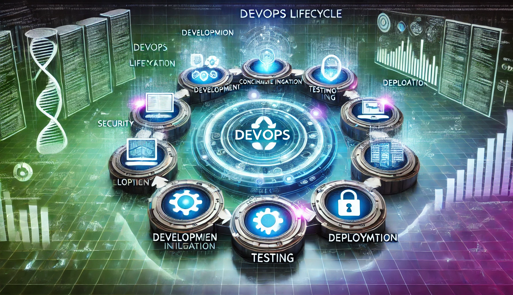

  
# 👨‍💻 Harol Alfonso Reina H.
## 🏗️ Arquitecto DevOps & Ingeniero de Sistemas

---

## 📍 Información de Contacto

---

## 🚀 Perfil Profesional

  

Soy un **🏗️ Arquitecto DevOps** con más de **10 años de experiencia** diseñando y optimizando soluciones de infraestructura escalable, seguridad en la nube y automatización de CI/CD. Mi experiencia incluye la integración de prácticas de **🔐 DevSecOps**, gestión de infraestructura como código (**📜 IaC**), y la implementación de microservicios y plataformas de contenedores. 

He trabajado con herramientas líderes como **Terraform**, **Ansible**, **Docker**, **Kubernetes**, **AWS**, **Azure**, y he liderado equipos para optimizar procesos de desarrollo y operaciones en entornos ágiles. Me apasiona mejorar la eficiencia operativa, reducir riesgos y garantizar seguridad en cada fase del ciclo de vida del software mediante la integración de herramientas de pruebas de seguridad, automatización de despliegues y monitoreo de infraestructuras.

### 💼 **10+ años** | 🔧 **DevOps Expert** | ☁️ **Cloud Architect** | 🔐 **Security Focus**

---

## 🛠️ Habilidades y Competencias

### 🔄 CI/CD y Automatización

### 📋 Metodologías Ágiles

### 🔐 DevSecOps & Seguridad

### 📜 Infraestructura como Código (IaC)

### 📦 Contenedores y Orquestación

### 💻 Lenguajes de Programación

### 🖥️ Sistemas Operativos

### 🌐 Redes y Protocolos

### 💾 Bases de Datos

### ☁️ Cloud Platforms

### 🛠️ Herramientas de Desarrollo

---

## 🏅 Certificaciones

| 🏆 Certificación | 🏢 Organización | 📅 Fecha | 🎯 Estado |
|:------------------|:------------------|:---------|:-----------|
|  | Amazon Web Services | Feb 2025 | ✅ Activa |
|  | Microsoft | Jul 2024 | ✅ Activa |
|  | AWS Educate | Feb 2025 | ✅ Activa |
|  | IPv6 Forum | Ago 2015 | ✅ Activa |
|  | Agile Alliance | Jun 2022 | ✅ Activa |

---

## 💼 Experiencia Laboral

  

### 🏗️ **Arquitecto DevOps y DevSecOps**
**PERIFERIA-IT GROUP** | 🌍 Bogotá (Remote) | **📅 2022-08 - Actualidad**

🔍 <strong>Ver responsabilidades y logros</strong>

- 🛡️ **Lideré el diseño e implementación** de soluciones de seguridad en pipelines CI/CD, incluyendo la integración de herramientas como **OWASP ZAP** para análisis automáticos de vulnerabilidades.
- ☁️ **Diseñé infraestructura escalable** en **Azure**, usando **Terraform** para la creación de pipelines de **infraestructura como código**, reduciendo el tiempo de despliegue en un **40%**.
- 🔐 **Implementé mejores prácticas** de seguridad en el ciclo de vida del software, incluyendo la **gestión de secretos** y la **automatización de auditorías de seguridad**.
- 👥 **Dirigí un equipo de DevSecOps**, mejorando la seguridad en las fases de desarrollo, producción y post-producción mediante la integración de controles de seguridad automatizados.

---

### 🏗️ **Arquitecto DevOps**
**Seguros TuPrimero Ltda** | 🌍 Bogotá (Remote) | **📅 2021-07 - 2023-09**

🔍 <strong>Ver responsabilidades y logros</strong>

- 📜 **Implementé soluciones de infraestructura como código** utilizando **CloudFormation** en **AWS**, mejorando la eficiencia de los despliegues y reduciendo los errores humanos.
- ⚡ **Desarrollé y mantuve microservicios** en **AWS Lambda**, **API Gateway**, **RDS**, y **Cognito**, integrando plataformas de pago, optimizando las transacciones de seguros en línea.
- 📊 **Integré SonarQube** en pipelines de CI/CD para análisis de calidad de código y pruebas automáticas de seguridad, aumentando la calidad del software en un **30%**.

---

### 🖥️ **Administrador De Infraestructura (WISP)**
**INGENIERÍA E INFORMÁTICA E.A.T.** | 📍 Villavicencio | **📅 2005-02 - 2021-07**

🔍 <strong>Ver responsabilidades y logros (16 años)</strong>

- 📡 **Administré y optimicé la infraestructura** de la red **WISP**, incluyendo **radioenlaces**, **servidores**, y **firewalls**, lo que permitió una mejor conectividad y seguridad en la red.
- 🌐 **Implementé protocolos de enrutamiento** como **RIP**, **OSPF**, y **BGP**, asegurando la interconexión eficiente y segura de diversas redes.
- 📈 **Realicé la instalación y configuración** de herramientas como **Nagios** para el monitoreo de servidores y **Shorewall** para la gestión de firewalls.
- 🤖 **Participé en procesos de automatización** y **optimización** de operaciones, lo que permitió una mejora significativa en la fiabilidad y disponibilidad de la infraestructura.

---

## 🎓 Educación

| 🎯 Título | 🏫 Institución | 📍 Ubicación | 📅 Año | 🎖️ Estado |
|:----------|:---------------|:-------------|:-------|:-----------|
| 🎓 **Máster en Desarrollo y Operaciones (DevOps)** | UNIR | 🇪🇸 La Rioja, España | 2025-05 - Actualidad | 📚 En curso |
| 🎓 **Ingeniero de Sistemas** | Fundación De Educación Superior SANJOSÉ | 🇨🇴 Bogotá, Colombia | 2023-07 | ✅ Completado |
| 📱 **Técnico Laboral en Habilidades en Programación con Énfasis en Aplicaciones Móviles** | UNAB | 🇨🇴 Bucaramanga, Colombia | 2022-01 | ✅ Completado |
| 💼 **Tecnólogo en Contabilidad y Finanzas** | SENA | 🇨🇴 Villavicencio, Colombia | 2012-01 | ✅ Completado |

---

## 📊 Estadísticas de GitHub

  
  
  
  
  
  
  

---

## 🏆 Logros y Reconocimientos

  
  
  

---

## 📈 Actividad de Contribuciones

  
  
  

---

## 🎯 Objetivos Actuales

### 🔮 **2025 - Enfoque Profesional**

- 🎓 **Completar Máster en DevOps** - UNIR (En progreso)
- ☁️ **Obtener certificaciones avanzadas** - AWS Solutions Architect Professional
- 🤖 **Profundizar en AI/ML Ops** - Integración de IA en pipelines DevOps
- 🏗️ **Arquitecturas Cloud-Native** - Microservicios y Serverless
- 🌐 **Contribuir al Open Source** - Proyectos de infraestructura

---

## 💡 Filosofía Profesional

> *"La automatización no es solo sobre herramientas, es sobre cultura, colaboración y mejora continua."*

### 🎯 **Principios Core**

**🔄 Automatización** • **🔐 Seguridad** • **📊 Monitoreo** • **🚀 Escalabilidad** • **🤝 Colaboración**

---

## 🤝 ¡Conectemos!

**¿Interesado en colaborar en proyectos DevOps o necesitas consultoría en infraestructura cloud?**

---

### ¡Gracias por visitar mi perfil! 🚀

